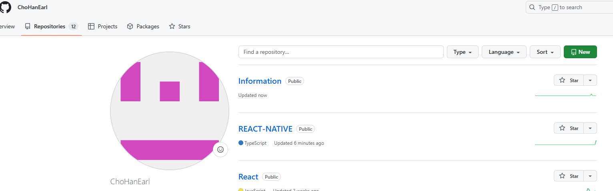
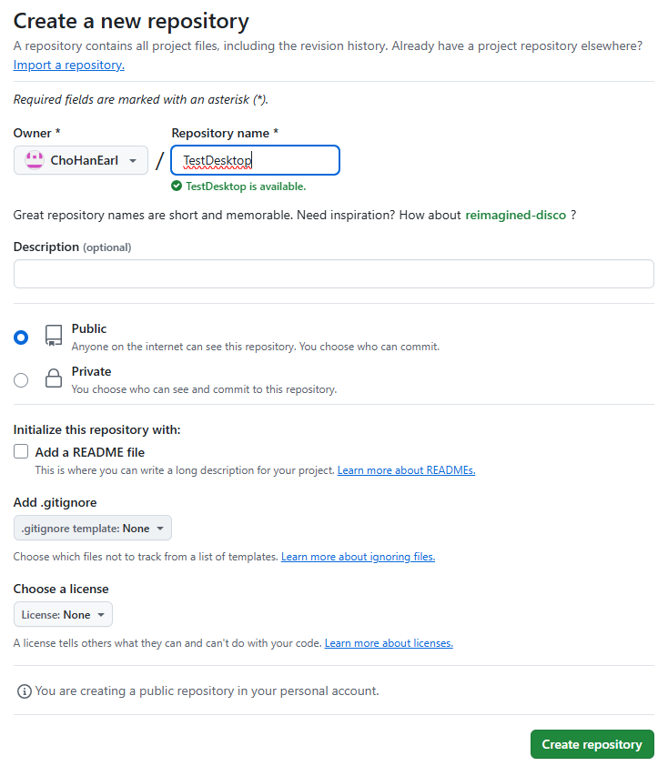

# Github Desktop으로 Github 업로드하기
1. 레포지토리 생성
- Github 본인의 프로필에서 파일을 업로드할 Repository를 생성한다.

- 우측 상단의 초록색 버튼(New) 클릭

- 사용할 레포지토리 이름을 입력하고 Create repository 버튼을 클릭한다.

- 생성한 Repository에서 Set up in Desktop 버튼을 클릭한다.

- 클릭하면 Github Desktop이 실행되고 다음과 같은 화면이 나타난다.
- 여기서 파일 경로를 지정해주고 clone을 누른다.

- 지정한 파일로 들어가보면 새로운 파일이 생성되어 있고 .git이 들어있는 것을 확인할 수 있다.

- 이제 데스크탑을 통해 업로드가 되는지 확인하기 위해 간단한 메모장 파일을 하나 추가해보자.

- 추가한 메모장 파일이 데스크탑에 활성화되었고 Hello World도 잘 나타난다.
- 이제 Commit & Push를 해보고 Github 웹사이트의 레포지토리에 적용이 되는지 확인해보자.

